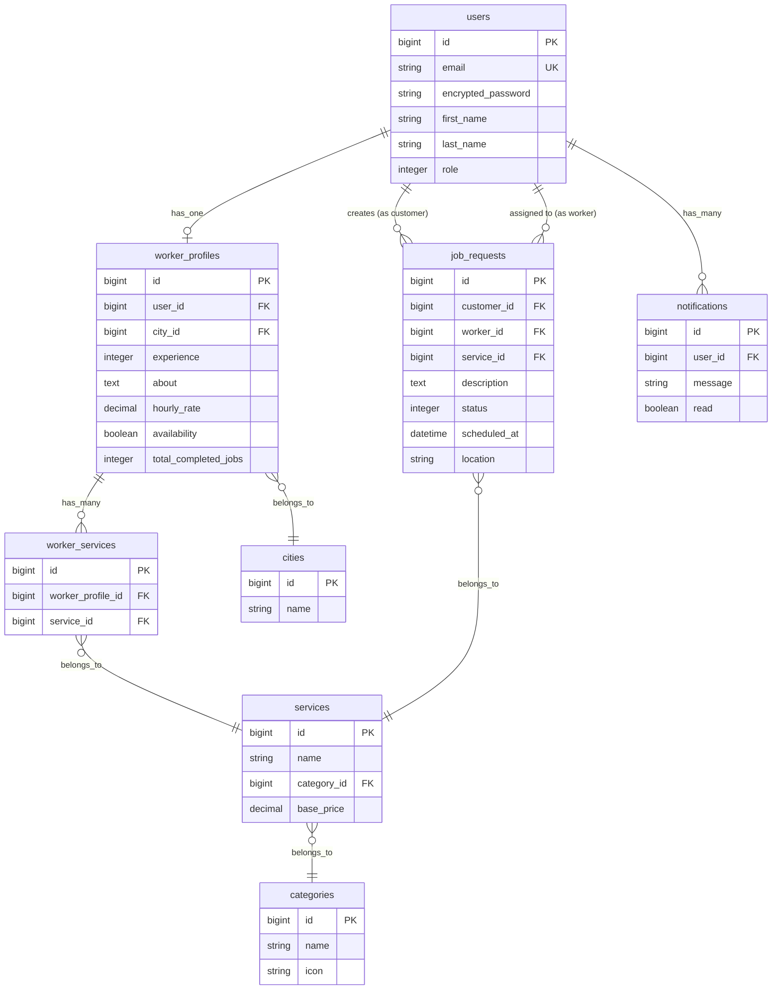

<p align="center">
  <h1 align="center">🔧 FixMate India</h1>
  <p align="center">
    A multi-city service marketplace connecting customers with verified electricians, plumbers, and AC repair technicians across India.
  </p>
</p>

<p align="center">
  
  
  
  
  
  
</p>

---

## 📋 Table of Contents

- [About the Project](#-about-the-project)
- [Features](#-features)
- [Tech Stack](#-tech-stack)
- [Architecture](#-architecture)
- [Prerequisites](#-prerequisites)
- [Getting Started](#-getting-started)
- [Project Structure](#-project-structure)
- [API Reference](#-api-reference)
- [Database Schema](#-database-schema)
- [Environment Variables](#-environment-variables)
- [Deployment](#-deployment)
- [Contributing](#-contributing)
- [License](#-license)

---

## 🎯 About the Project

**FixMate India** is a structured, scalable platform designed to bridge the gap between customers and skilled service professionals in Indian cities. In India, most skilled workers operate offline with no digital presence — FixMate solves this by providing a transparent, standardized booking and job management workflow.

### The Problem

- Skilled workers (electricians, plumbers, etc.) mostly operate offline
- No structured digital marketplace for local service providers
- Customers rely on unreliable referrals or random contacts
- No transparency or standardization in the booking process

### The Solution

FixMate provides a clean, professional marketplace where:
- **Customers** can search, filter, and book verified workers by city and service type
- **Workers** can create profiles, manage availability, and receive job notifications
- The entire job lifecycle is tracked: `pending → accepted → completed`

---

## ✨ Features

### For Customers
- 🔐 Secure registration and login (JWT-based)
- 🏙️ City-based worker search and filtering
- 🔍 Filter by category (Electrician, Plumber, AC Repair) and specific services
- 📋 Submit detailed job requests with image uploads
- 📊 Track job status in real-time
- 🔔 In-app notifications

### For Workers
- 👤 Create and manage professional profile
- 🛠️ List services offered with hourly rates (₹)
- 🟢 Toggle availability status
- 📧 Email notifications for new job requests (ActionMailer)
- ✅ Accept, reject, or complete jobs
- 📈 Track completed jobs count

### Platform
- 📱 Fully responsive (mobile, tablet, desktop)
- 🌐 RESTful API with versioning (`/api/v1`)
- 🔒 Role-based access control
- 🖼️ Image upload support via ActiveStorage
- ⚡ Optimized with database indexing and pagination

---

## 🛠️ Tech Stack

| Layer          | Technology                                      |
|----------------|--------------------------------------------------|
| **Backend**    | Ruby on Rails 8.0 (API mode)                     |
| **Frontend**   | Next.js 14 (App Router + TypeScript)             |
| **Database**   | PostgreSQL                                       |
| **Auth**       | Devise + devise-jwt (JWT tokens)                 |
| **Styling**    | TailwindCSS 3.4                                  |
| **HTTP Client**| Axios                                            |
| **Icons**      | Lucide React                                     |
| **File Upload**| Rails ActiveStorage                              |
| **Email**      | Rails ActionMailer (letter_opener in dev)         |
| **Web Server** | Puma                                             |
| **Deployment** | Docker + Kamal                                   |

---

## 🏗️ Architecture

```
┌──────────────────────────┐       ┌──────────────────────────┐
│                          │       │                          │
│   Next.js 14 Frontend    │◄─────►│   Rails 8 API Backend    │
│   (Port 3000)            │ JSON  │   (Port 3001)            │
│                          │       │                          │
│  ┌────────────────────┐  │       │  ┌────────────────────┐  │
│  │ App Router (Pages) │  │       │  │ API Controllers    │  │
│  │ Components (React) │  │       │  │ Models (AR)        │  │
│  │ Axios HTTP Client  │  │       │  │ ActionMailer       │  │
│  │ TailwindCSS        │  │       │  │ ActiveStorage      │  │
│  │ Cookie-based JWT   │  │       │  │ Devise + JWT       │  │
│  └────────────────────┘  │       │  └────────────────────┘  │
│                          │       │            │             │
└──────────────────────────┘       │  ┌─────────▼──────────┐  │
                                   │  │   PostgreSQL DB     │  │
                                   │  └────────────────────┘  │
                                   └──────────────────────────┘
```

---

## 📦 Prerequisites

Ensure you have the following installed on your machine:

| Tool           | Version   | Installation Guide                                      |
|----------------|-----------|----------------------------------------------------------|
| **Ruby**       | 3.2.2     | [rbenv](https://github.com/rbenv/rbenv) or [rvm](https://rvm.io/) |
| **Node.js**    | ≥ 18.x    | [nvm](https://github.com/nvm-sh/nvm) or [nodejs.org](https://nodejs.org/) |
| **PostgreSQL** | ≥ 14      | [postgresql.org](https://www.postgresql.org/download/)   |
| **Bundler**    | ≥ 2.x     | `gem install bundler`                                    |
| **npm**        | ≥ 9.x     | Comes with Node.js                                       |
| **Git**        | Latest    | [git-scm.com](https://git-scm.com/)                     |

---

## 🚀 Getting Started

### 1. Clone the Repository

```bash
git clone https://github.com/your-username/fixmate.git
cd fixmate
```

### 2. Backend Setup (Rails API)

```bash
# Navigate to backend
cd backend

# Install Ruby dependencies
bundle install

# Create and setup the database
rails db:create
rails db:migrate

# Seed initial data (cities, categories, services)
rails db:seed

# Start the Rails server on port 3001
rails server -p 3001
```

> **💡 Tip:** The seed file pre-populates 5 cities (Indore, Mumbai, Bhopal, Delhi, Pune), 3 categories (Electrician, Plumber, AC Repair), and 9 services with base prices in INR.

### 3. Frontend Setup (Next.js)

```bash
# Open a new terminal and navigate to frontend
cd frontend

# Install Node.js dependencies
npm install

# Start the development server
npm run dev
```

The frontend will be available at **http://localhost:3000**

### 4. Verify the Setup

| Service    | URL                          | Status Check                |
|------------|------------------------------|-----------------------------|
| Frontend   | http://localhost:3000        | Should show the landing page |
| Backend    | http://localhost:3001        | Rails default page          |
| API Health | http://localhost:3001/api/v1/cities | Should return JSON list of cities |

> **📌 Note:** For Option B (combined deployment), after building and copying frontend files to `backend/public/`, visiting `http://localhost:3001/` will show the frontend home page, and API calls will work via relative paths.

---

## 📁 Project Structure

```
fixmate/
├── README.md                  # ← You are here
├── PRD.md                     # Product Requirements Document
│
├── backend/                   # Rails 8 API application
│   ├── app/
│   │   ├── controllers/api/v1/  # API controllers (versioned)
│   │   ├── models/              # ActiveRecord models
│   │   ├── mailers/             # Email templates (JobMailer)
│   │   └── views/               # Mailer views
│   ├── config/
│   │   ├── routes.rb            # API route definitions
│   │   └── database.yml         # Database configuration
│   ├── db/
│   │   ├── migrate/             # Database migrations (11 files)
│   │   ├── schema.rb            # Current database schema
│   │   └── seeds.rb             # Seed data for dev environment
│   ├── Dockerfile               # Production Docker image
│   ├── Gemfile                  # Ruby dependencies
│   └── README.md                # Backend-specific docs
│
├── frontend/                  # Next.js 14 application
│   ├── src/
│   │   ├── app/                 # App Router pages
│   │   │   ├── login/           # Login page
│   │   │   ├── register/        # Registration page
│   │   │   ├── customer/        # Customer dashboard
│   │   │   ├── worker/          # Worker dashboard
│   │   │   └── jobs/            # Job management
│   │   ├── components/          # Reusable React components
│   │   │   ├── Navbar.tsx
│   │   │   ├── Sidebar.tsx
│   │   │   ├── HeroSection.tsx
│   │   │   ├── WorkerCard.tsx
│   │   │   ├── ServiceCard.tsx
│   │   │   └── ...
│   │   └── lib/
│   │       └── api.ts           # Axios API client configuration
│   ├── package.json             # Node.js dependencies
│   ├── tailwind.config.js       # TailwindCSS theme config
│   └── README.md                # Frontend-specific docs
```

---

## 📡 API Reference

Base URL:
- Development: `http://localhost:3001/api/v1`
- Production (Option A - Separate): Use your deployed backend URL (e.g., `https://fixmate-api.onrender.com/api/v1`)
- Production (Option B - Combined): `/api/v1` (relative path, same domain as frontend)

### Authentication

| Method | Endpoint                | Description            | Auth Required |
|--------|-------------------------|------------------------|:------------:|
| POST   | `/auth/register`        | Register a new user    | ❌           |
| POST   | `/auth/login`           | Login and get JWT      | ❌           |
| DELETE | `/auth/logout`          | Logout (invalidate JWT)| ✅           |

### Users

| Method | Endpoint                | Description            | Auth Required |
|--------|-------------------------|------------------------|:------------:|
| GET    | `/users/me`             | Get current user info  | ✅           |

### Workers

| Method | Endpoint                | Description            | Auth Required |
|--------|-------------------------|------------------------|:------------:|
| GET    | `/workers`              | List all workers       | ❌           |
| GET    | `/workers/:id`          | Get worker details     | ❌           |
| GET    | `/workers/profile`      | Get own worker profile | ✅ (Worker)  |
| PUT    | `/workers/profile`      | Update worker profile  | ✅ (Worker)  |
| PATCH  | `/workers/availability` | Toggle availability    | ✅ (Worker)  |

### Jobs

| Method | Endpoint                | Description            | Auth Required |
|--------|-------------------------|------------------------|:------------:|
| POST   | `/jobs`                 | Create a job request   | ✅ (Customer)|
| GET    | `/jobs/my`              | List my jobs           | ✅           |
| GET    | `/jobs/:id`             | Get job details        | ✅           |
| PATCH  | `/jobs/:id/accept`      | Accept a job           | ✅ (Worker)  |
| PATCH  | `/jobs/:id/reject`      | Reject a job           | ✅ (Worker)  |
| PATCH  | `/jobs/:id/complete`    | Mark job as completed  | ✅ (Worker)  |
| PATCH  | `/jobs/:id/cancel`      | Cancel a job           | ✅ (Customer)|

### Lookup Data

| Method | Endpoint                | Description            | Auth Required |
|--------|-------------------------|------------------------|:------------:|
| GET    | `/cities`               | List supported cities  | ❌           |
| GET    | `/categories`           | List service categories| ❌           |

### Notifications

| Method | Endpoint                        | Description            | Auth Required |
|--------|----------------------------------|------------------------|:------------:|
| GET    | `/notifications`                 | List my notifications  | ✅           |
| GET    | `/notifications/unread_count`    | Get unread count       | ✅           |
| PATCH  | `/notifications/:id/mark_read`   | Mark as read           | ✅           |

---

## 🗄️ Database Schema



### Job Status Flow

```
┌─────────┐     ┌──────────┐     ┌───────────┐
│ pending  │────►│ accepted │────►│ completed │
└─────────┘     └──────────┘     └───────────┘
     │
     ├─────────►┌──────────┐
     │          │ rejected │
     │          └──────────┘
     │
     └─────────►┌───────────┐
                │ cancelled │
                └───────────┘
```

- **Workers** can: accept, reject, or complete jobs
- **Customers** can: cancel jobs (only before acceptance)

---

## 🔐 Environment Variables

### Backend (`backend/`)

| Variable                    | Description                        | Default                |
|-----------------------------|------------------------------------|------------------------|
| `RAILS_ENV`                | Environment (development/production)| `development`         |
| `RAILS_MASTER_KEY`         | Encryption key for credentials     | Auto-generated         |
| `BACKEND_DATABASE_PASSWORD`| PostgreSQL password (production)   | —                      |
| `RAILS_MAX_THREADS`        | Max thread pool size               | `5`                    |

### Frontend (`frontend/`)

The API base URL is configured in `src/lib/api.ts`:

```typescript
const api = axios.create({
  baseURL: 'http://localhost:3001/api/v1',
});
```

> For production, update this to your deployed backend URL or use an environment variable.

---

## 🐳 Deployment

### Option A: Separate Deployments (Recommended)

Deploy backend and frontend as separate services:

#### Backend (Docker / Kamal / Render)

```bash
cd backend

# Build the Docker image
docker build -t fixmate-backend .

# Run the container
docker run -d -p 80:80 \
  -e RAILS_MASTER_KEY=<value from config/master.key> \
  --name fixmate-backend \
  fixmate-backend
```

The backend is pre-configured for [Kamal](https://kamal-deploy.org/) deployment:

```bash
cd backend
kamal setup    # First-time deployment
kamal deploy   # Subsequent deployments
```

#### Frontend (Vercel / Node.js / Static Hosting)

```bash
cd frontend

# Build for production
npm run build

# Start production server
npm start
```

> **💡 Tip:** The Next.js frontend can be easily deployed to [Vercel](https://vercel.com/) with zero configuration.

### Option B: Combined Deployment (Backend serves Frontend)

Serve the frontend from the backend at the root path, with API routes under `/api`:

#### 1. Build Frontend as Static Files

```bash
cd frontend
npm run build
```

This generates static files in the `out/` directory.

#### 2. Copy Frontend to Backend Public Folder

```bash
# Copy built frontend to backend public directory
cp -r frontend/out/* backend/public/
```

#### 3. Deploy Backend

The backend is now configured to:
- Serve API routes under `/api/v1/*`
- Serve frontend static files for all other routes

Deploy the backend using Docker, Kamal, or Render as shown above.

> **⚠️ Note:** When using this option, frontend API calls use relative paths (`/api/v1`) which resolve to the backend on the same domain.

---

## 🤝 Contributing

Contributions are welcome! Here's how to get started:

1. **Fork** the repository
2. **Create** a feature branch
   ```bash
   git checkout -b feature/amazing-feature
   ```
3. **Commit** your changes
   ```bash
   git commit -m "feat: add amazing feature"
   ```
4. **Push** to the branch
   ```bash
   git push origin feature/amazing-feature
   ```
5. **Open** a Pull Request

### Development Guidelines

- Follow [Rails conventions](https://guides.rubyonrails.org/) for backend code
- Use TypeScript for all frontend code
- Run `rubocop` for Ruby linting
- Run `npm run lint` for frontend linting
- Write descriptive commit messages

---

## 📄 License

This project is licensed under the **MIT License**. See the [LICENSE](LICENSE) file for details.

---

## 🌟 Acknowledgements

- [Ruby on Rails](https://rubyonrails.org/) — Backend framework
- [Next.js](https://nextjs.org/) — React framework for the frontend
- [TailwindCSS](https://tailwindcss.com/) — Utility-first CSS framework
- [Devise](https://github.com/heartcombo/devise) — Authentication for Rails
- [Lucide](https://lucide.dev/) — Beautiful icon library

---

<p align="center">
  Made with ❤️ for India
</p>
